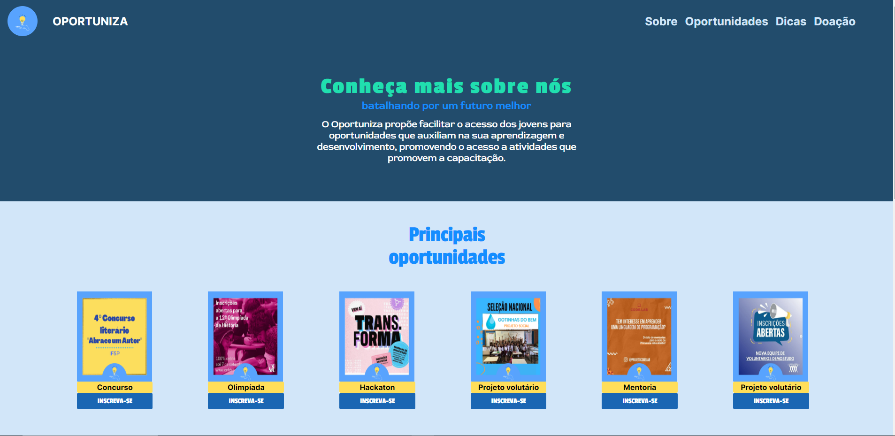

# projetoOportuniza
<h1 align="center">Oportuniza</h1>

Projeto feito a partir de uma adaptação de um Hackathon que tem um objetivo social. 

  <a href="#-tecnologias">Tecnologias</a>&nbsp;&nbsp;&nbsp;|&nbsp;&nbsp;&nbsp;
  <a href="#-projeto">Projeto</a>&nbsp;&nbsp;&nbsp;|&nbsp;&nbsp;&nbsp;
  <a href="#memo-licença">Licença</a>

  

 

 
    

## 🚀 Tecnologias

-Nesse projeto foi utilizado as seguintes tecnologias:

-CSS  
-HTML  
-JS  
-Github  

## 💻 Projeto

O projeto teria como objetivo ajudar os recentes ou próximos formados a se prepara para o mercado do trabalho por isso traz oportunidades de eventos, vagas, projetos e curso, além de dicas para essas pessoas.

- [Visite o projeto online](https://helenapl145.github.io/projetoOportuniza/)

Esse projeto está sob a licença MIT.

---

Feito com ♥ by Helena Lima

